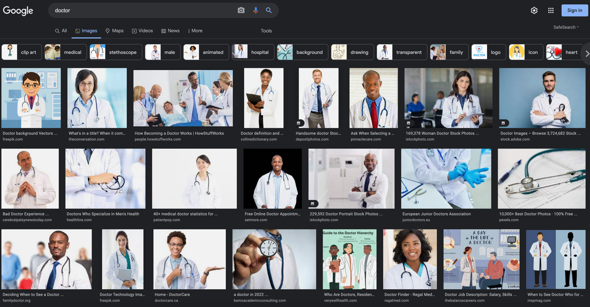
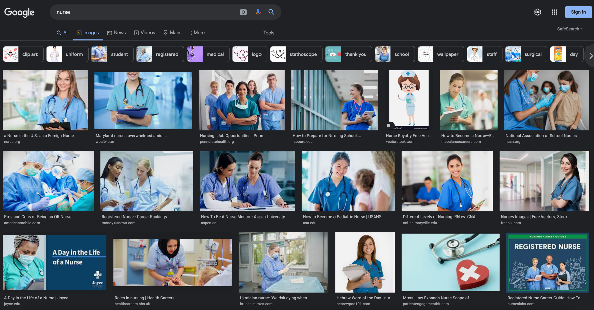
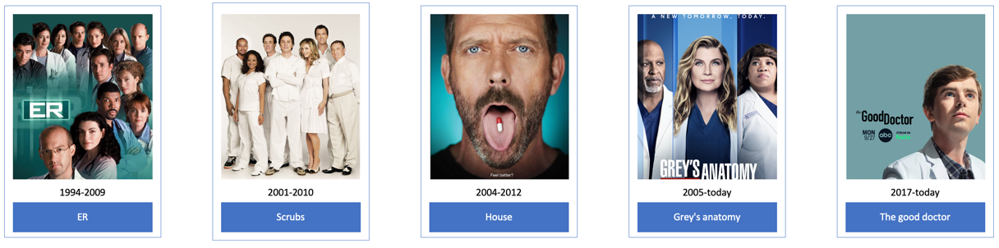

# DHproject
A project in digital humanization  
By Omer Lerner & Igal Boxerman Ben-Gurion University , CS dept. 2022

## Our Goal 
**See gender changes in MD TV series across 1990-today**
- **Head counts - fe/male doctors/nurses**
- **Seniority (positions) - presidents, chiefs, head nurse**    
### Why we think there is a difference?
Simple google search can answer this question.  
When we searched _"nurse"_ in Google, we got pictures of women only.

When we searched _"doctor"_ in Google, we discovered that there are many black & women.    
We think that this is a gender equality action from Google side.

## Our motivation
As we have progressed through the decades, we have seen many organizations, protests, and activists fight for equal gender roles and rights.  
With the surge of social media, this has been more felt than ever, with people advocating and speaking up against unfair treatment.  
The gap has been closing in the real world, and we were interested to see whether the gap is closing in the entertainment business.  

We tend to attribute more “masculine” roles to men and more “feminine” roles to women.  
This is why, in our opinion, doctors are thought to be primarily male, and nurses are thought to be primarily women.   
In the Hebrew language, most people call doctors "רופאים", which is male, and nurses "אחיות", which is female.   
Our goal is to research Medical TV Shows from 1990 to today and see if equal gender roles made their way into TV Shows – What’s the % of male vs female doctors, what’s the % of male vs female nurses, and which sex has more senior positions (President of the hospital, chief of staff, chief of surgery, head nurse, etc).

We assume that shows in the 1990s will feature a more male-oriented cast – Most of the cast will be male doctors, with a minority of female doctors, and most of the nurses will be female, with a minority of male nurses.  
We believe that throughout the years, medical TV shows will feature a more diverse cast where more women are doctors and hold senior positions, while also increasing the percentage of male nurses.  
In the picture below you can see some progress as in _Gery's Anatomy_ the main character is a woman and in _the Good Doctor_ it is a man with autism.

## Work process
We will begin our research by choosing a select number of TV Shows – We will choose X TV Shows that started in each decade (the 1990s, 2000s, 2010s, and 2020 [if relevant]) by their success/ratings.   
After choosing these shows, we will use our APIs to query data.  
We are interested in the cast, their role on the show, and if they get promoted throughout the show.   

After we query the relevant data, we will run a script that calculates the following things:
-	Percentage of female doctors
-	Percentage of male nurses
-	Percentage of female doctors in senior positions
-	Percentage of male head nurses
After we calculate the data, we will use Tableau to generate graphs that depict the calculated data.

## Technical stuff
### tools & dependencies
We will use some of these:
#### Databases & APIS
- [tmdb](https://www.themoviedb.org/)
  - For querying data about TV series, their casts, episodes etc.
- [imdb](https://developer.imdb.com/)
  - For querying data about TV series and specific details about some actors
- [the movie db](https://www.themoviedb.org/documentation/api)
  - For querying data about TV series, their casts, episodes etc.
- [wikidata](https://www.wikidata.org/wiki/Wikidata:Main_Page)
  - For investigating things about actors
- [wikipedia](https://en.wikipedia.org/wiki/Main_Page)
  - For investigating things about actors

#### Python libraries
- requests
  - For executing queries on different APIs
- pandas
  - For handling `CSV` and `JSON` file easily as `DataFrames`
- itertools
  - For simple iterating
- sqlite
  - For SQL if needed
#### Other programs
- Tableau
  - For generate detailed graphs with amazing insights